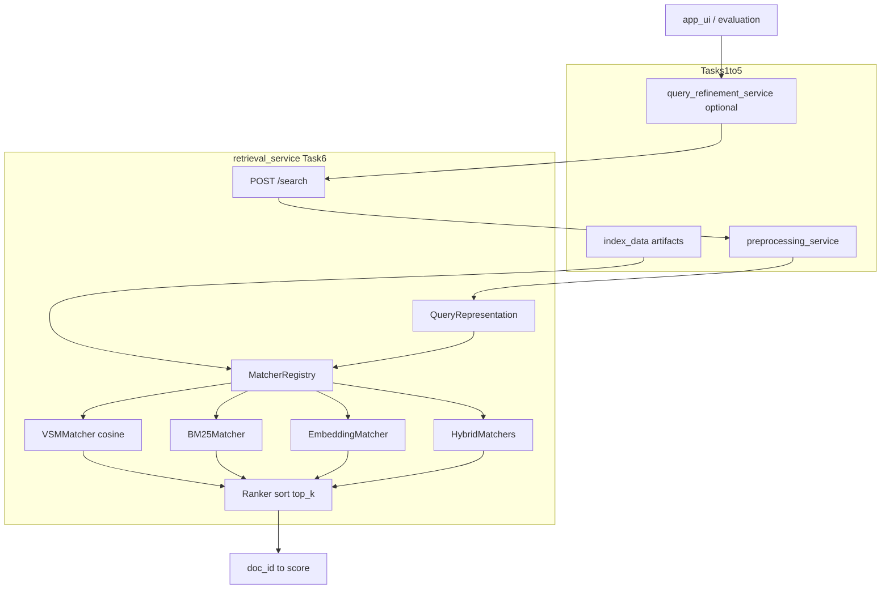

# Task 6 — Query Matching & Ranking (Full Completion Plan)

## Current baseline (already implemented)

Task 6 logic exists but is **implicit** inside [`retrieval_service/app/main.py`](retrieval_service/app/main.py) and [`retrieval_service/app/core/search_engine.py`](retrieval_service/app/core/search_engine.py):

| Mode | Matcher | Status |
|------|---------|--------|
| `vsm` | Cosine TF-IDF (`search_vsm`) | Done |
| `bm25` | BM25 sum scoring | Done |
| `embedding` | Cosine similarity (full scan) | Done |
| `hybrid_parallel` | RRF fusion | Done |
| `hybrid_serial` | BM25 filter → embedding rerank | Done |

Supporting infrastructure already in place:
- Index reload on `mtime` + `/reload-index` in [`retrieval_service/app/main.py`](retrieval_service/app/main.py)
- `doc_norms` at index time in [`shared/index_builder.py`](shared/index_builder.py)
- `SERIAL_HYBRID_TOP_N=100` in [`shared/ir_config.py`](shared/ir_config.py)
- Evaluation calls `POST /search` per mode in [`evaluation_service/app/main.py`](evaluation_service/app/main.py)
- Partial regression tests in [`tests/test_retrieval_regression.py`](tests/test_retrieval_regression.py)
- UI already has BM25 sliders + `top_n_filter` for serial hybrid in [`app_ui.py`](app_ui.py)

**Gap:** no dedicated matching module, no matcher metadata in API, no VSM unit tests, no FAISS, evaluation outputs go to `reports/` not `evaluation_results/`, no `docs/task-06.md`.

---

## Target architecture



**SOA decision:** keep Task 6 inside `retrieval_service` (matches assignment §7 Retrieval + Ranking). Do **not** split into a separate microservice until after Task 6 is complete.

---

## Matching contract (assignment requirement)

| Mode | Query input | Index artifacts | Function | Sort |
|------|-------------|-----------------|----------|------|
| `vsm` | tokens | `vsm_index.json`, `metadata.doc_norms` | dot → cosine | desc |
| `bm25` | tokens | `bm25_index.json`, `metadata` | BM25 term sum | desc |
| `embedding` | raw text | `embeddings_index.json` | cosine | desc |
| `hybrid_parallel` | tokens + text | BM25 + embeddings | RRF | desc |
| `hybrid_serial` | tokens + text | BM25 → embeddings | BM25 top-N → cosine rerank | desc |

---

## Two-step Cursor execution strategy

Split work so each Cursor session is **focused, testable, and shippable** without burning context on unrelated files.

### Cursor Session A — Core refactor + correctness (Phases 0–3 + partial 5)

**Goal:** explicit matcher layer, tests pass, API returns matcher metadata. No FAISS yet.

**Estimated touch:** ~8–12 files, ~400–600 LOC moved/refactored.

### Cursor Session B — Scale + integration + docs (Phases 4–8)

**Goal:** FAISS/performance, full evaluation matrix, UI polish, `task-06` docs.

**Estimated touch:** ~10–15 files including indexer + requirements.

**Rule between sessions:** Session A must end with all existing tests green + new matcher unit tests green before starting Session B.

---

# SESSION A — Core Matching Module (Phases 0–3 + API metadata)

## Phase 0 — Prerequisites gate (30 min, no code unless failing)

Verify before any refactor:

1. **Canonical index path** — `IR_INDEX_DIR` → [`index_data/`](index_data/) only; no duplicate roots.
2. **VSM cosine** — `search_vsm()` divides by `query_norm * doc_norm` (already in [`main.py:86-131`](retrieval_service/app/main.py)).
3. **Serial hybrid pool** — `top_n_filter` default ≥ 100 via `SERIAL_HYBRID_TOP_N`.
4. **Index manifest** — `index_manifest.json` written on save ([`shared/index_builder.py`](shared/index_builder.py)).
5. **Stage B index** — run `python -m indexing_service.app.core.indexer --scale preval` once; record doc count in manifest.

**Exit gate:** `GET http://127.0.0.1:8002/health` → `index_files_detected: true`.

---

## Phase 1 — Extract matching/ranking module

Create package:

```
retrieval_service/app/core/matching/
├── __init__.py
├── base.py           # QueryRepresentation, MatchParams, MatchResult, BaseMatcher, Ranker
├── registry.py       # get_matcher(mode) factory
├── vsm_matcher.py
├── bm25_matcher.py
├── embedding_matcher.py
└── hybrid_matcher.py # parallel + serial
```

### `base.py` contracts

```python
@dataclass
class QueryRepresentation:
    raw_text: str
    tokens: List[str]
    mode: str

@dataclass
class MatchParams:
    k1: float = 1.5
    b: float = 0.75
    top_n_filter: int = SERIAL_HYBRID_TOP_N
    k_rrf: int = 60

class BaseMatcher(Protocol):
    matching_method: str  # e.g. "cosine_similarity", "bm25", "rrf"
    def match(self, query: QueryRepresentation, params: MatchParams) -> Dict[str, float]: ...

class Ranker:
    @staticmethod
    def rank(scores: Dict[str, float], top_k: Optional[int]) -> Dict[str, float]:
        # stable sort: score desc, then doc_id asc for ties
```

### Migration map

| Current | New |
|---------|-----|
| `search_vsm()` in `main.py` | `VSMMatcher` (move logic verbatim) |
| `BM25SearchEngine.search` | `BM25Matcher` wraps engine |
| `EmbeddingSearchEngine.search` | `EmbeddingMatcher` wraps engine |
| `HybridSearchEngine.*` | `HybridParallelMatcher`, `HybridSerialMatcher` |

Keep [`search_engine.py`](retrieval_service/app/core/search_engine.py) as the **index-loading layer** initially; matchers delegate to it. Deprecate direct calls from `main.py` only.

### `registry.py`

```python
MATCHER_REGISTRY = {
    "vsm": VSMMatcher,
    "bm25": BM25Matcher,
    ...
}
MATCHER_METADATA = {
    "vsm": {"matching_method": "cosine_similarity", ...},
    ...
}
```

### Slim down `main.py`

Replace `if/elif` block (lines 207–229) with:

```python
matcher = get_matcher(mode)
query_repr = QueryRepresentation(raw_text=request.query, tokens=query_tokens, mode=mode)
params = MatchParams(k1=request.k1, b=request.b, top_n_filter=...)
scores = matcher.match(query_repr, params)
results = Ranker.rank(scores, request.top_k)
```

Inject shared engine instances into matchers at startup (same singleton pattern as today).

---

## Phase 2 — Query representation boundary (Task 4 ↔ Task 6)

1. Build `QueryRepresentation` **once** after preprocessing in `execute_search`.
2. Matchers must **not** re-call preprocessing.
3. Document consistency rule in `base.py` docstring:
   - VSM/BM25: same tokens + log-TF-IDF / BM25 as index time
   - Embedding: same `EMBEDDING_MODEL` from [`shared/ir_config.py`](shared/ir_config.py)
4. Add `embedding_model` and `preprocess_flags` to search response (read from manifest/metadata).

---

## Phase 3 — Harden matchers + unit tests

### Per-matcher hardening

| Matcher | Action |
|---------|--------|
| **VSM** | Prefer `metadata.doc_norms`; fallback compute (keep current fallback) |
| **BM25** | Pass `k1`/`b` through `MatchParams`; include in response |
| **Embedding** | Keep `normalize_embeddings=True`; add `encode_ms` timing |
| **Hybrid parallel** | Add `RRF_K` to `ir_config.py` (default 60), expose in `MatchParams` |
| **Hybrid serial** | `top_n_filter` from request; document tuning range 100–500 |

### New tests: `tests/test_matchers.py`

Use tiny **committed fixture** at `tests/fixtures/index_data/` (3–5 docs, deterministic scores):

- `test_vsm_cosine_ordering` — known tokens → expected top-3 doc_ids
- `test_bm25_ordering`
- `test_embedding_ordering` (mock SentenceTransformer or use fixed vectors in fixture)
- `test_hybrid_parallel_rrf_ordering`
- `test_hybrid_serial_respects_top_n_filter`
- `test_ranker_stable_tiebreak`

Extend [`tests/test_retrieval_regression.py`](tests/test_retrieval_regression.py) to import matchers instead of engines directly.

### Config additions in [`shared/ir_config.py`](shared/ir_config.py)

```python
RRF_K = int(os.environ.get("IR_RRF_K", "60"))
MATCHER_METADATA = { ... }  # mode → matching_method label
```

---

## Phase 5 (partial) — API contract in Session A

### Extend `POST /search` response

```json
{
  "status": "success",
  "mode_used": "vsm",
  "matcher": "vsm",
  "matching_method": "cosine_similarity",
  "params": { "k1": 1.5, "b": 0.75, "top_n_filter": 100, "k_rrf": 60 },
  "query_tokens": [...],
  "total_results": 10,
  "results": { "doc_id": 0.87 },
  "timing": {
    "preprocess_ms": 12.0,
    "match_ms": 45.0,
    "rank_ms": 0.5,
    "total_ms": 58.0
  }
}
```

### New endpoint: `GET /matchers`

Returns list from `MATCHER_METADATA` (mode, matching_method, required inputs).

### Empty-result reasons

Return structured detail when:
- index not ready (503, existing)
- zero overlapping VSM/BM25 terms → `"reason": "no_lexical_overlap"`
- embedding model load failure → `"reason": "embedding_model_unavailable"`

---

## Session A — Done criteria

- [ ] All 5 modes route through `MatcherRegistry`
- [ ] `search_vsm` removed from `main.py` (lives in `VSMMatcher`)
- [ ] `GET /matchers` works
- [ ] Search response includes `matcher`, `matching_method`, `params`, split timing
- [ ] `tests/test_matchers.py` passes
- [ ] Existing `tests/test_retrieval_regression.py` passes
- [ ] Manual smoke: one query per mode on Stage B index

---

# SESSION B — Scale, Evaluation, UI, Docs (Phases 4–8)

## Phase 4 — Performance and scale

### 4a — NumPy batch embedding (quick win, no new deps)

In `EmbeddingMatcher`:
- Stack doc vectors into matrix when `doc_count < FAISS_THRESHOLD` (e.g. 10K)
- Single `query_vec @ doc_matrix.T` instead of Python loop
- Gate behind `IR_EMBEDDING_BACKEND=numpy|loop` in config

### 4b — FAISS vector store (assignment §11 alignment)

**Index time** ([`shared/index_builder.py`](shared/index_builder.py) + [`indexing_service/app/core/indexer.py`](indexing_service/app/core/indexer.py)):
1. After embeddings batch, build `faiss.IndexFlatIP` (inner product on L2-normalized vectors)
2. Save `embeddings.faiss` + `embeddings_id_map.json` (row index → doc_id)
3. Extend manifest: `ann_backend: "faiss"`, `embedding_dim`, `vector_count`

**Query time** ([`embedding_matcher.py`](retrieval_service/app/core/matching/embedding_matcher.py)):
1. Load FAISS index at startup if file exists
2. Search top `k` (use `top_k` or default 1000 for candidate pool)
3. Fall back to JSON full scan if FAISS missing (dev/toy indexes)

**Dependencies:** add `faiss-cpu` to [`requirements.txt`](requirements.txt) (optional extra: document `pip install faiss-cpu`).

### 4c — Timing breakdown

Split current `ranking_ms` into:
- `encode_ms` (embedding query only)
- `match_ms` (scoring / FAISS search)
- `rank_ms` (sort + truncate)

### 4d — Early termination

- BM25: optional heap top-k when `top_k` set and `doc_count` large (defer if complex; document as future optimization)
- FAISS: always search exactly `top_k` neighbors

---

## Phase 5 (complete) — Observability

1. Log per-request: `mode`, `matching_method`, `match_ms`, `results_count`
2. `GET /health` includes: `ann_backend`, `embedding_model`, `index_doc_count`
3. Persist matcher version in manifest for reproducibility

---

## Phase 6 — Evaluation integration

Evaluation is **mostly wired** ([`evaluation_service/app/main.py`](evaluation_service/app/main.py)); Session B completes:

1. **Output directory** — write to `evaluation_results/` (keep `reports/` as alias or migrate CLI default in [`evaluation_service/run.py`](evaluation_service/run.py))
2. **Include matcher metadata** in eval report per mode (from search response)
3. **Run matrix** (document commands):

```powershell
# Stage B baseline — all 5 modes, 50–100 dev queries
python -m evaluation_service.run --scale preval --max-queries 100 --output-dir evaluation_results

# Stage C full (before submission)
python -m indexing_service.app.core.indexer --scale full
python -m evaluation_service.run --scale full --max-queries 500 --output-dir evaluation_results
```

4. **Acceptance table** in report:

| Mode | MAP | Recall | P@10 | nDCG@10 | match_ms p50 |
|------|-----|--------|------|---------|--------------|

5. Tune `top_n_filter` (100 vs 300 vs 500) for `hybrid_serial` on Stage B; record best default in config.

---

## Phase 7 — UI integration

Update [`app_ui.py`](app_ui.py):

1. **Display** `matching_method` and `params` from search response (sidebar or results header)
2. **Add** optional `top_k` slider for result display (default: show all or 20)
3. **Confirm** `top_n_filter` slider visible for `hybrid_serial` (already exists ~line 244)
4. **Refinement path** — verify [`shared/search_pipeline.py`](shared/search_pipeline.py) unchanged except consuming new response fields; same matcher registry behind `/search`

---

## Phase 8 — Documentation and report deliverables

Create mirroring existing task docs:

| File | Content |
|------|---------|
| [`docs/task-06.md`](docs/task-06.md) | Requirement, implementation, files, algorithms table, evaluation snapshot |
| [`docs/ar/task-06.md`](docs/ar/task-06.md) | Arabic equivalent |
| [`docs/task-06-implementation-plan.md`](docs/task-06-implementation-plan.md) | This plan (condensed) |
| Update [`docs/README.md`](docs/README.md) | Link task-06, mark Task 6 complete in alignment snapshot |
| Update [`docs/ar/implementation-overview.md`](docs/ar/implementation-overview.md) | Section 6: matching module + FAISS |

**Arabic report subsection** (copy into final report):
- عنوان: **مطابقة الاستعلام وترتيب النتائج**
- جدول mode → matching method
- مثال JSON لنتائج مرتبة مع الدرجات
- تبرير اختيار cosine لـ VSM/Embedding وRRF للهجين المتوازي

---

## Session B — Done criteria (Task 6 fully complete)

1. Every mode uses documented matching function via `MatcherRegistry`
2. Results strictly sorted desc with deterministic tie-break
3. Query/doc representation consistency enforced and documented
4. Stage B index: all modes return results in &lt; acceptable latency (document p50/p95)
5. FAISS enabled for embedding at Stage B+ (or documented fallback with scale plan)
6. Evaluation JSON for all 5 modes in `evaluation_results/`
7. UI shows `matching_method` + params
8. `docs/task-06.md` + Arabic version exist
9. Arabic report subsection drafted

---

## File change summary

| File | Session A | Session B |
|------|-----------|-----------|
| `retrieval_service/app/core/matching/*` | Create | FAISS in embedding_matcher |
| `retrieval_service/app/main.py` | Refactor orchestration | Health fields |
| `retrieval_service/app/core/search_engine.py` | Keep, delegate | FAISS load helper |
| `shared/ir_config.py` | RRF_K, MATCHER_METADATA | FAISS flags, backends |
| `shared/index_builder.py` | — | FAISS build + manifest |
| `indexing_service/app/core/indexer.py` | — | Trigger FAISS save |
| `tests/test_matchers.py` | Create | FAISS tests |
| `evaluation_service/run.py` | — | output dir, metadata |
| `app_ui.py` | — | matching_method display |
| `requirements.txt` | — | faiss-cpu |
| `docs/task-06*.md` | — | Create |

---

## Risk notes

| Risk | Mitigation |
|------|------------|
| Refactor breaks existing search | Session A ends with full test suite green before Session B |
| FAISS install fails on Windows | Keep JSON fallback; document `faiss-cpu` install |
| Embedding tests need model download | Use fixed vectors in fixture; mock encode in unit tests |
| Evaluation slow on full scale | Run `--max-queries` subset during dev; full run before submission |

---

## Recommended timeline

| Day | Session | Deliverable |
|-----|---------|-------------|
| 1 | A | Matcher module + tests + API metadata |
| 2 | B (morning) | NumPy batch + FAISS index build |
| 2 | B (afternoon) | Stage B eval + UI + docs |
