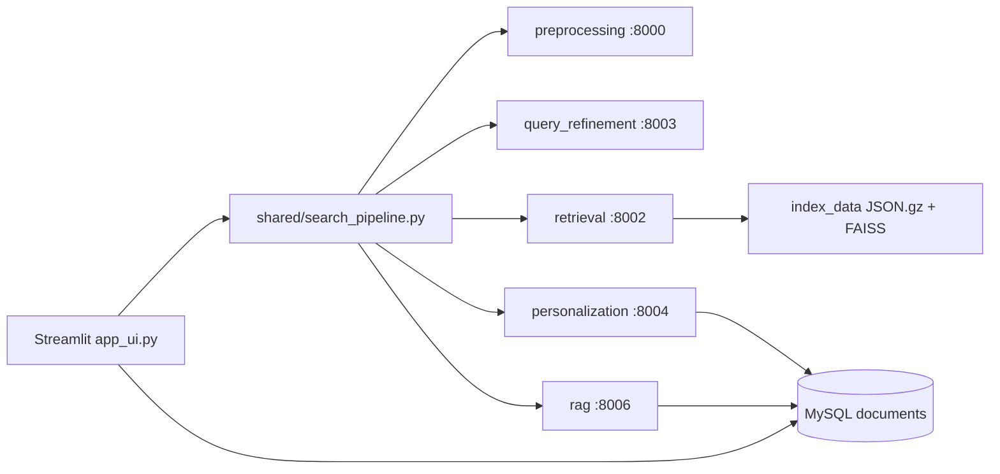

# IR Core Project — Service Map

## Architecture



## Services

| Service | Port | Entry | Key endpoints |
|---------|------|-------|----------------|
| preprocessing_service | 8000 | `preprocessing_service/app/main.py` | `POST /preprocess`, `/preprocess-batch` |
| retrieval_service | 8002 | `retrieval_service/app/main.py` | `POST /search`, `GET /health`, `POST /reload-index` |
| query_refinement_service | 8003 | `query_refinement_service/app/main.py` | `POST /refine` |
| personalization_service | 8004 | `personalization_service/app/main.py` | `POST /rerank`, `/events/query`, `/events/click` |
| clustering_service | 8005 | `clustering_service/app/main.py` | `GET /cluster/meta`, `/cluster/comparison` |
| rag_service | 8006 | `rag_service/app/main.py` | `POST /generate` |
| indexing_service | CLI | `indexing_service/app/core/indexer.py` | batch index build |
| evaluation_service | CLI | `evaluation_service/app/main.py` | official dev qrels eval |
| Streamlit UI | 8501 | `app_ui.py` | search, full docs, eval insights |

## Dataset scope (demo)

- **Indexed:** first 200,000 MS MARCO passages (`index_data/`)
- **Evaluation:** `msmarco-passage/dev` qrels only — see `docs/dataset-scope-ar.md`
- **Not claimed:** full 8.8M corpus (optional isolated copy: `docs/isolated-full-scale-setup.md`)

## Quick start

```powershell
.\scripts\start_stack.ps1
streamlit run app_ui.py
```

## Docs

- [Hybrid explained (AR)](docs/hybrid-explained-ar.md)
- [Interview cheatsheet (AR)](docs/interview-cheatsheet-ar.md)
- [Developer guide](docs/developer-guide.md)

## Index compression

After building or migrating indexes:

```powershell
python scripts/compress_index_artifacts.py
```

Retrieval loads `.json.gz` when present; embedding model warms up at service startup.
