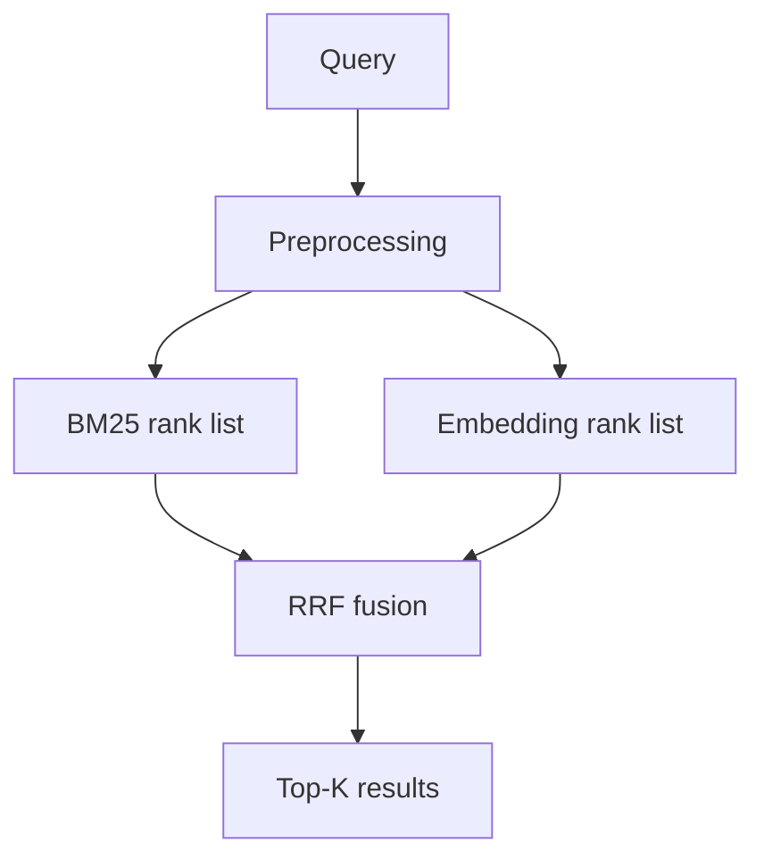

# شرح البحث الهجين (Hybrid)

## الهجين المتموازي — RRF

1. يُشغَّل BM25 و Embedding **بالتوازي** على نفس الاستعلام.
2. لكل وثيقة في أي من القائمتين:
   - مساهمة BM25 = `وزن_BM25 / (k_rrf + رتبة_BM25)`
   - مساهمة Embedding = `وزن_Embedding / (k_rrf + رتبة_Embedding)`
3. الدرجة النهائية = مجموع المساهمتين، ثم ترتيب تنازلي.

**k_rrf** (افتراضي 60): يخفّف فرق الرتب العالية — كلما زاد، قلّ تمييز المراكز الأولى.

**الأوزان** (من الواجهة): تسمح بإعطاء أولوية أكبر للمطابقة اللفظية أو الدلالية.

## الهجين التسلسلي (Serial)

1. BM25 يختار أفضل `top_n_filter` مرشحاً (افتراضي 100).
2. Embedding يعيد ترتيب هؤلاء المرشحين فقط بـ cosine similarity.
3. إذا فشل التضمين، يُعاد ترتيب BM25 الأصلي.

**متى نستخدمه؟** عندما تريد سرعة BM25 مع دقة دلالية على مجموعة صغيرة من المرشحين.

## أرقام من التقييم (dev qrels)

راجع `evaluation_results/FINAL_EVAL_SUMMARY.md`:
- Embedding غالباً الأعلى في nDCG@10 على 59 استعلاماً محكوماً.
- Hybrid Parallel قريب من Embedding لأن RRF يستفيد من القائمة الدلالية.

## أين الكود؟

| جزء | ملف |
|-----|-----|
| RRF | `retrieval_service/app/core/matching/hybrid_matcher.py` |
| معاملات API | `retrieval_service/app/main.py` |
| الواجهة | `ui/sidebar.py` (إعدادات متقدمة) |
| التنسيق | `shared/search_pipeline.py` |

