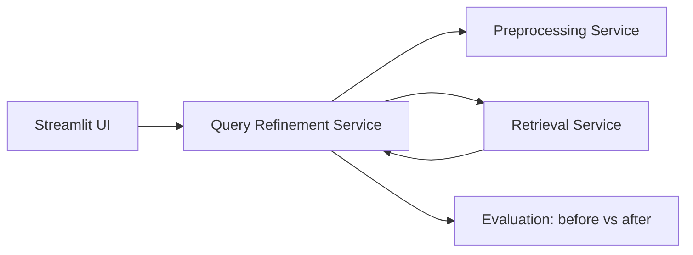

# Task 05 — Query Refinement: Sequential Implementation Plan

Focused plan for **Task 5 — Query refinement** on **MS MARCO Passage**
(`msmarco-passage` / evaluation on `msmarco-passage/dev`).

This document is the execution guide. Implement phases **in order**; do not skip
prerequisites or evaluation checkpoints.

---

## What the dataset gives us

From `shared/ir_config.py` and MS MARCO documentation:

| Property | Implication for refinement |
|----------|---------------------------|
| **English** web passages | WordNet / corpus expansion, spell-check, PRF all fit; no multilingual refinement needed |
| **Natural-language questions** (search-log style) | Reformulation is less important; **term mismatch** and **vocabulary gap** matter more |
| **Short queries, long passages** | Synonym/expansion and PRF help bridge query↔passage wording |
| **Shallow qrels** (~1–2 relevant docs/query) | Metrics like **MRR@10 / P@10 / nDCG** are meaningful; refinement gains should be measurable |
| **Official dev queries + qrels** via `ir_datasets` | Run **before vs after** refinement evaluation (assignment §8) |
| **No real user sessions** in the benchmark | History-based refinement is useful for **UI/demo**, not for automated qrels eval |

**Current baseline (Task 4):** query preprocessing + representation-specific ranking
(VSM, BM25, embedding, hybrid).

**Task 5 goal:** add a **refinement layer before retrieval**, implemented as a separate
SOA service: `query_refinement_service`.

---

## Target architecture



---

## Feature scope and priorities

| Priority | Feature | Role | Evaluable on dev qrels? |
|----------|---------|------|-------------------------|
| **P0** | **RM3 / Rocchio PRF** | Main measurable gain | Yes |
| **P0** | **WordNet synonym expansion** (toggle) | Static expansion | Yes |
| **P1** | **Query-specific preprocessing** | Keep question words / query-only stopword policy | Yes |
| **P2** | **Query suggestions** from MS MARCO query list | Formulation assistance in UI | Mostly UX |
| **P2** | **Session history merge** | Enrich from past searches in UI | Demo only |

### Strong fit — implement

1. **Pseudo-Relevance Feedback (PRF), e.g. RM3 or Rocchio**
   - First-pass retrieval (BM25 is natural for MS MARCO).
   - Take top-*k* docs, extract salient terms, merge into the query.
   - Classic IR technique; directly measurable on `msmarco-passage/dev`.
   - Works best with **BM25 / VSM / hybrid_parallel**; for embedding, use expanded
     raw text as embedding input.

2. **Query expansion with synonyms (WordNet + optional corpus terms)**
   - MS MARCO queries are short; passages often use different words.
   - **WordNet** is cheap, English-only, no extra dataset.
   - Optional: light corpus terms from indexed passage vocabulary.
   - Combine with PRF: PRF for dynamic expansion, WordNet as static fallback.

3. **Query-aware preprocessing**
   - Global stopword removal can hurt question queries:
     `"what is the capital of france"` → `"capital france"`.
   - Query-specific rules: keep WH-words (`what`, `how`, `why`) or skip stopword
     removal for queries only.

### Good for UI + report (secondary for metrics)

4. **Query suggestion / autocomplete** — prefix or fuzzy match over MS MARCO query strings.
5. **Search-history enrichment** — merge last *N* session queries with decay weights.

### Skip or deprioritize

| Technique | Why skip for now |
|-----------|------------------|
| Neural query rewriting (LLM) | Hard to evaluate fairly; overlaps with optional RAG (§10) |
| Multilingual refinement | Dataset is English-only |
| Personalization / user profiles | No profile data in MS MARCO |
| Full conversational reformulation | Queries are already well-formed questions |
| Full-corpus synonym dictionary | Expensive; WordNet + PRF is enough |
| Spell-checking (optional) | Useful for live UI typos; dev queries are usually clean |

**Minimum defensible Task 5:** RM3 PRF + WordNet expansion + before/after evaluation.

---

## Prerequisites (complete before Phase 1)

Do not start refinement logic until these are in place (see `docs/project-notes.md`):

1. **Canonical index path** — single `IR_INDEX_DIR`, no duplicate artifact roots.
2. **Working evaluation pipeline** — MAP, Recall, P@10, nDCG via `evaluation_service`.
3. **Baseline metrics captured** — refinement **off**, all representation modes, on dev queries.
4. **Stage B index at minimum** — run `--scale preval` (20K–50K docs) before claiming gains;
   use `--scale full` for final report numbers.

### Baseline evaluation command

```powershell
python -m evaluation_service.run --scale preval --max-queries 50
```

Save the report under `reports/` as `baseline_task4_pre_refinement.json`.

---

## Phase 0 — Service skeleton and config

### Goal

Create `query_refinement_service` as an independent FastAPI microservice with a
pass-through refine endpoint (no logic yet).

### Steps

1. Add directory layout:
   - `query_refinement_service/app/main.py`
   - `query_refinement_service/app/core/refiner.py`
   - `query_refinement_service/app/models.py`
2. Extend `shared/ir_config.py`:
   - `REFINEMENT_URL` (default `http://127.0.0.1:8003`)
   - `REFINEMENT_TECHNIQUES` defaults
   - PRF params: `PRF_TOP_K_DOCS`, `PRF_TOP_M_TERMS`, `PRF_ORIGINAL_QUERY_WEIGHT`
3. Define API contract — `POST /refine`:

   **Request:**
   - `raw_query: str`
   - `enabled_techniques: list[str]` — `["prf", "synonyms", "history", "query_preprocess"]`
   - `previous_queries: list[str]` (optional)
   - `representation_mode: str` (for PRF first-pass mode selection)

   **Response:**
   - `raw_query`
   - `refined_query: str`
   - `expanded_terms: list[str]`
   - `techniques_applied: list[str]`
   - `explanation: str` (human-readable, for report)

4. Pass-through implementation: return `refined_query == raw_query`.
5. Add `GET /health`.
6. Wire retrieval / UI to call refinement optionally (`use_refinement: bool` flag).

### Files to touch

- `query_refinement_service/` (new)
- `shared/ir_config.py`
- `retrieval_service/app/main.py` (optional refine hook or keep refinement upstream in UI/gateway)
- `app_ui.py` (toggle: basic vs basic+refinement)

### Done criteria

- Service starts on port 8003.
- `POST /refine` returns valid JSON with pass-through behavior.
- Health check passes.

---

## Phase 1 — Query-specific preprocessing (P1)

### Goal

Apply query-only preprocessing rules before shared preprocessing, preserving
question structure for MS MARCO-style queries.

### Steps

1. In `refiner.py`, add `apply_query_preprocess(raw_query) -> str`:
   - Detect question-style queries (leading WH-word or trailing `?`).
   - Option A: skip stopword removal for queries (pass flag to preprocessing service).
   - Option B: keep a whitelist of terms (`what`, `how`, `why`, `when`, `where`, `who`, `which`).
2. Extend preprocessing service (if needed):
   - Add `is_query: bool` or `preserve_wh_words: bool` to `/preprocess` request.
   - When true, do not remove WH-words from token list.
3. Document behavior difference: **documents** vs **queries** preprocessing paths.
4. Unit tests:
   - `"what is machine learning"` retains `what` (or skips aggressive stopword drop).
   - Non-question queries behave as before.

### Files to touch

- `query_refinement_service/app/core/refiner.py`
- `preprocessing_service/app/main.py`
- `preprocessing_service/app/core/cleaner.py`
- `tests/test_query_preprocess.py` (new)

### Done criteria

- Refinement service applies query-specific rules when `query_preprocess` is enabled.
- Tokens differ measurably from document-style preprocessing for WH-questions.
- Existing document indexing path unchanged.

### Evaluation checkpoint

Run eval with only `query_preprocess` enabled vs baseline. Record delta in `reports/`.

---

## Phase 2 — WordNet synonym expansion (P0)

### Goal

Expand query terms with English synonyms to reduce vocabulary mismatch.

### Steps

1. Add dependency: NLTK WordNet (`nltk.download("wordnet")`, `omw-1.4` if needed).
2. Implement `expand_synonyms(tokens: list[str], max_synonyms_per_term: int = 2) -> list[str]`:
   - For each content token (skip stopwords / WH-words already handled).
   - Collect synset lemmas; normalize to lowercase; deduplicate.
   - Cap total expansion (avoid query blow-up).
3. Merge expanded terms into `refined_query` string and `expanded_terms` list.
4. Add config toggles in `ir_config.py`:
   - `SYNONYM_MAX_PER_TERM`
   - `SYNONYM_MAX_TOTAL`
5. Optional (later): corpus term filter — only keep synonyms that appear in indexed vocabulary
   (load top terms or vocabulary set from `metadata.json` / BM25 index).

### Files to touch

- `query_refinement_service/app/core/synonym_expander.py` (new)
- `query_refinement_service/app/core/refiner.py`
- `shared/ir_config.py`
- `requirements.txt`

### Done criteria

- `enabled_techniques: ["synonyms"]` adds non-empty `expanded_terms` for typical queries.
- Expansion is deterministic and bounded.
- No change when technique disabled.

### Evaluation checkpoint

- Baseline vs `synonyms` only.
- Baseline vs `query_preprocess + synonyms`.
- Save reports under `reports/refinement_synonyms_*.json`.

---

## Phase 3 — Pseudo-Relevance Feedback: RM3 (P0)

### Goal

Implement two-pass retrieval: BM25 first pass → extract feedback terms → merge into refined query.

### Steps

1. Implement `prf_rm3(raw_query, tokens, top_k_docs, top_m_terms) -> list[str]`:
   - Call retrieval service internally: `POST /search` with `representation_mode=bm25`, `top_k=PRF_TOP_K_DOCS`.
   - Load document texts or preprocessed tokens for top docs (from index metadata or new artifact field).
   - Compute term weights from feedback documents (RM3 formula or simplified Rocchio).
   - Merge with original query term weights (`PRF_ORIGINAL_QUERY_WEIGHT`).
   - Return expanded token list / refined query string.
2. Handle edge cases:
   - Empty first-pass results → return original query unchanged.
   - Timeout / retrieval unavailable → graceful fallback, log warning.
3. Add internal-only retrieval call config (`RETRIEVAL_URL` already in shared config).
4. If document raw text is not in index artifacts, add optional `doc_texts` snippet map
   during indexing **or** use BM25 index term postings as proxy (terms from top doc IDs only).

### RM3 parameters (defaults to tune on dev)

| Parameter | Suggested start |
|-----------|-----------------|
| `PRF_TOP_K_DOCS` | 5–10 |
| `PRF_TOP_M_TERMS` | 10–20 |
| `PRF_ORIGINAL_QUERY_WEIGHT` | 0.5 |
| Feedback term weight | 0.5 |

### Per-mode behavior

| Mode | Refinement application |
|------|------------------------|
| `bm25`, `vsm`, `hybrid_parallel`, `hybrid_serial` | PRF on **tokens** after preprocessing |
| `embedding` | Build **refined raw text** string for encoder input |

### Files to touch

- `query_refinement_service/app/core/prf.py` (new)
- `query_refinement_service/app/core/refiner.py`
- `query_refinement_service/app/main.py`
- `shared/ir_config.py`
- Possibly `indexing_service` / `metadata.json` if doc text lookup needed

### Done criteria

- PRF runs two-pass flow end-to-end on dev index.
- `explanation` field describes top feedback docs and added terms.
- Fallback to original query when first pass returns nothing.

### Evaluation checkpoint

- Baseline vs `prf` only (BM25 and hybrid modes first).
- Combined: `prf + synonyms`, `prf + query_preprocess + synonyms`.
- Expect largest gains on **BM25** and **hybrid**; document embedding-only delta separately.

---

## Phase 4 — Integrate refinement into search pipeline

### Goal

End-to-end query flow: user query → refine → preprocess → retrieve → rank.

### Steps

1. Choose integration point (recommended: **UI / API gateway** calls refine, then retrieval):
   - `raw_query` → `POST /refine` → `refined_query` → `POST /search`.
   - Keep retrieval service focused on matching/ranking (clean SOA).
2. Add request flags:
   - `use_refinement: bool`
   - `refinement_techniques: list[str]`
3. Return refinement metadata in search response:
   - `refined_query`, `expanded_terms`, `techniques_applied`
4. Streamlit UI:
   - Checkbox: "Enable query refinement"
   - Multi-select or preset: PRF / synonyms / history / query preprocess
   - Show `explanation` and expanded terms in results panel
5. Assignment UI requirement: **basic vs basic+additional** execution modes.

### Files to touch

- `app_ui.py`
- `api_gateway/` (if used)
- `retrieval_service/app/main.py` (response shape only, if needed)

### Done criteria

- User can search with refinement on/off from UI.
- Search response includes refinement trace for report screenshots.
- Refinement off reproduces baseline behavior exactly.

---

## Phase 5 — Query suggestions (P2, UX)

### Goal

Provide formulation assistance via autocomplete over MS MARCO query strings.

### Steps

1. Build query index offline script:
   - `scripts/build_query_suggestion_index.py`
   - Load queries from `ir_datasets.load("msmarco-passage/dev")` (+ optional train split).
   - Save compact prefix index or sorted list to `index_data/query_suggestions.json`.
2. Add `GET /suggest?q=cap&limit=5` to refinement service.
3. Implement prefix match (binary search on sorted list) or simple trie.
4. Streamlit: `st.selectbox` or autocomplete on `text_input` (Streamlit limitations — use
   `suggest` results shown below input as clickable chips).

### Files to touch

- `scripts/build_query_suggestion_index.py` (new)
- `query_refinement_service/app/core/suggestions.py` (new)
- `query_refinement_service/app/main.py`
- `app_ui.py`

### Done criteria

- Typing `"how to"` returns plausible MS MARCO-style suggestions.
- Suggestion index builds in reasonable time from dev queries.
- Feature documented as UX-only (not used in qrels eval unless simulating partial queries).

---

## Phase 6 — Session history enrichment (P2, demo)

### Goal

Enrich current query with terms from previous searches in the same UI session.

### Steps

1. In Streamlit `st.session_state`, store last *N* queries (default 5).
2. Pass `previous_queries` to `POST /refine` when `history` technique enabled.
3. Implement simple merge:
   - Tokenize previous queries (lightweight, no PRF).
   - Weight decay: most recent = 1.0, older = 0.5, 0.25, …
   - Append high-weight terms not already in current query.
4. Cap total added terms (e.g. 5).

### Files to touch

- `query_refinement_service/app/core/history.py` (new)
- `query_refinement_service/app/core/refiner.py`
- `app_ui.py`

### Done criteria

- Second search in session can inherit context from first.
- `explanation` lists which history terms were added.
- Disabled when `history` not in `enabled_techniques`.

---

## Phase 7 — Evaluation and report (assignment §8)

### Goal

Produce before/after metrics proving refinement impact.

### Evaluation protocol

1. **Baseline** — refinement off, all modes: `vsm`, `bm25`, `embedding`, `hybrid_parallel`, `hybrid_serial`.
2. **Ablations** — one technique at a time:
   - `query_preprocess`
   - `synonyms`
   - `prf`
3. **Combined best** — recommended stack: `query_preprocess + prf + synonyms`.
4. Run on `msmarco-passage/dev` (fast iteration) or `msmarco-passage/dev/small`.
5. Final numbers on `--scale full` or `--scale preval` index.

### Metrics (minimum)

- MAP
- Recall
- Precision@10
- nDCG

### Extend evaluation service

Add refinement parameters to eval runner:

```python
# evaluation_service/run.py — future flags
--use-refinement
--refinement-techniques prf,synonyms,query_preprocess
```

Eval flow: for each query → `POST /refine` → `POST /search` with refined query.

### Report content (Arabic final report)

- Architecture diagram including Query Refinement Service.
- Description of each technique and why it fits MS MARCO.
- Before/after tables per representation mode.
- Which modes improved most (expect BM25/hybrid > embedding).
- Parameter choices (PRF top-k, synonym caps) and justification.

### Done criteria

- At least one refinement configuration shows measurable improvement over baseline
  on Stage B+ index; or honest analysis if gains are small.
- All reports saved under `reports/` with timestamps.
- `docs/task-05.md` completion doc written (mirror task-01..04 format).

---

## Suggested implementation order (summary)

| Step | Phase | Deliverable |
|------|-------|-------------|
| 1 | Prerequisites | Baseline eval report saved |
| 2 | Phase 0 | Empty refinement service + config |
| 3 | Phase 1 | Query-specific preprocessing |
| 4 | Phase 2 | WordNet synonym expansion |
| 5 | Phase 3 | RM3 PRF |
| 6 | Phase 4 | Full pipeline + UI toggle |
| 7 | Phase 5 | Query suggestions (UX) |
| 8 | Phase 6 | Session history (demo) |
| 9 | Phase 7 | Before/after evaluation + report |

---

## API reference (target)

### `POST /refine`

```json
{
  "raw_query": "what is information retrieval",
  "enabled_techniques": ["query_preprocess", "prf", "synonyms"],
  "previous_queries": ["search engine basics"],
  "representation_mode": "bm25"
}
```

```json
{
  "raw_query": "what is information retrieval",
  "refined_query": "what information retrieval search document ranking",
  "expanded_terms": ["search", "document", "ranking"],
  "techniques_applied": ["query_preprocess", "prf", "synonyms"],
  "explanation": "PRF added terms from top-5 BM25 docs; WordNet expanded 'retrieval'."
}
```

### `GET /suggest?q=how&limit=5`

```json
{
  "query_prefix": "how",
  "suggestions": ["how to tie a tie", "how much does a passport cost"]
}
```

---

## What not to implement first

- Full query rewriting with an LLM (save for optional §10 RAG if approved).
- Building a synonym dictionary from the entire 8.8M corpus.
- History-based refinement as the **only** refinement (not validated on MS MARCO qrels alone).

---

## Related docs

- `docs/project-notes.md` — Task 5 readiness and prerequisites
- `docs/task-04.md` — Query processing baseline
- `docs/tasks-1-4-focused-implementation-plan.md` — Index scale strategy
- `docs/developer-guide.md` — Running services and evaluation
- `IR Project 2026.md` — Assignment requirements (§5, §7, §8)
